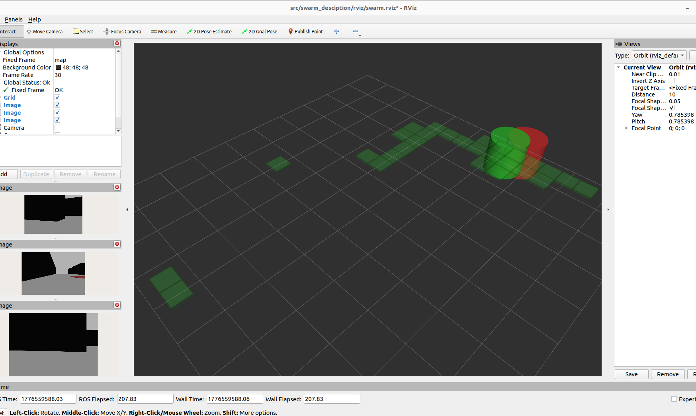
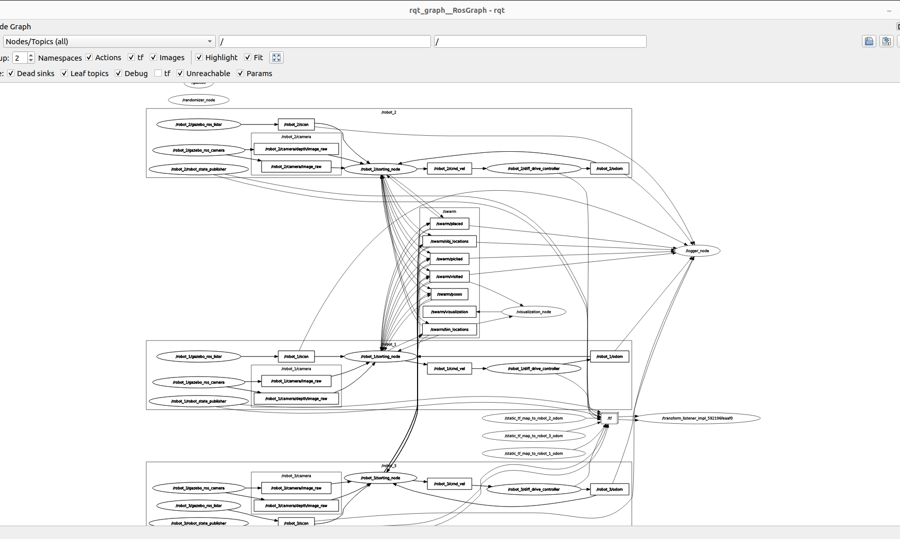
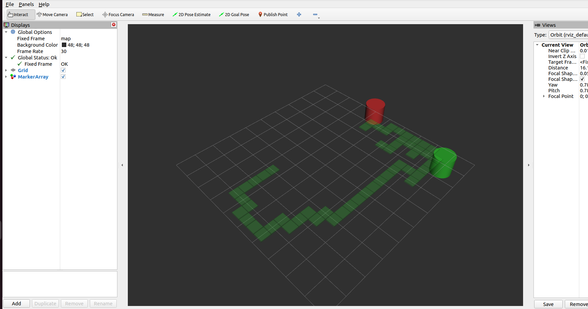

# Autonomous Multi-Agent Swarm Sorting System

> **CS671 Deep Learning Hackathon 2026 — Team 20, IIT Mandi**

A fully autonomous multi-robot collaborative system built on **ROS 2 (Humble)** and **Gazebo Classic**, where three differential-drive robots cooperatively **explore** a warehouse environment, **discover** colour-coded objects, **navigate** to them using a PPO-trained Reinforcement Learning policy, and **sort** each object into its corresponding colour-matched bin — all without any human intervention.

---

## 📹 Video Demo

| Resource | Link |
|----------|------|
| **Full Demo (Gazebo + RViz)** | [▶ Watch on Google Drive](https://drive.google.com/drive/folders/1rAmYx1uS0PYUlfmj3ElJ-irtzrGSKGEo?usp=sharing) |

---

## 📑 Table of Contents

- [Overview](#overview)
- [Key Features](#key-features)
- [System Architecture](#system-architecture)
- [Repository Structure](#repository-structure)
- [Detailed Component Descriptions](#detailed-component-descriptions)
  - [Package: `swarm_description`](#package-swarm_description)
  - [Package: `swarm_nav`](#package-swarm_nav)
  - [Report Generator](#report-generator)
- [Environment Details](#environment-details)
- [How It Works: End-to-End Pipeline](#how-it-works-end-to-end-pipeline)
- [Reinforcement Learning](#reinforcement-learning)
- [Inter-Robot Communication](#inter-robot-communication)
- [Visualisation & Logging](#visualisation--logging)
- [Installation & Setup](#installation--setup)
- [Usage](#usage)
- [Dependencies](#dependencies)
- [Team](#team)

---

## Overview

The project addresses the challenge of **autonomous collaborative object sorting** in a structured warehouse environment. Three identical robots are spawned in a simulated 10 m × 8 m warehouse populated with shelves, three colour-coded objects (red, green, blue), and three corresponding colour-coded bins placed at randomised positions. The robots must:

1. **Explore** the warehouse to discover objects and bins.
2. **Communicate** discoveries via a shared ROS 2 topic layer so that information is immediately available to all agents.
3. **Navigate** to objects using a hybrid decision architecture: a PPO-trained RL policy for general locomotion combined with classical deterministic overrides for precision manoeuvres (camera alignment, obstacle avoidance).
4. **Pick** objects, **transport** them past obstacles, and **place** them in the correct bin.
5. **Terminate** autonomously once all three objects have been sorted.

<p align="center">
  
  <br/>
  <em>Figure 1 — RViz dashboard showing live RGB camera feeds from all three robots alongside the shared exploration map.</em>
</p>

---

## Key Features

| Feature | Description |
|---------|-------------|
| **PPO-Based RL Navigation** | A Proximal Policy Optimisation (PPO) model trained in a lightweight Gymnasium environment drives forward motion, turning, and exploration. |
| **Hybrid Decision Architecture** | RL output is combined with classical overrides — camera-based alignment, obstacle avoidance, wall-following — for robust real-world behaviour. |
| **Shared Swarm Communication** | Robots broadcast visited grid cells, discovered object/bin locations, and pick/place events over global `/swarm/*` topics, enabling true collaborative behaviour. |
| **Randomised Object & Bin Placement** | A dedicated `RandomizerNode` teleports objects and bins to verified collision-free positions at simulation start, ensuring no two runs are identical. |
| **HSV-Based Colour Detection** | An onboard RGB-D camera pipeline detects red, green, and blue objects/bins using HSV masking with depth-based distance estimation. |
| **360° LiDAR Obstacle Avoidance** | A 360-sample planar LiDAR provides wall-front and wall-side detection for reactive avoidance and wall-following navigation modes. |
| **Real-Time RViz Visualisation** | Visited grid cells and shared bin locations are published as `MarkerArray` messages for live monitoring in RViz. |
| **Automated PDF Report Generation** | Post-simulation JSON logs are processed into a professional multi-page PDF report with executive summary, spatial trajectory analysis, and Gantt-style task timelines. |

---

## System Architecture

```
┌──────────────────────────────────────────────────────────────────────┐
│                        GAZEBO SIMULATION                            │
│  ┌──────────┐  ┌──────────┐  ┌──────────┐                          │
│  │ robot_1  │  │ robot_2  │  │ robot_3  │    Warehouse World       │
│  │  LiDAR   │  │  LiDAR   │  │  LiDAR   │    (10m × 8m)           │
│  │  RGB-D   │  │  RGB-D   │  │  RGB-D   │    8 shelves, 3 objects  │
│  │  DiffDrv │  │  DiffDrv │  │  DiffDrv │    3 bins               │
│  └────┬─────┘  └────┬─────┘  └────┬─────┘                          │
│       │              │              │                                │
└───────┼──────────────┼──────────────┼────────────────────────────────┘
        │              │              │
   ┌────▼────┐    ┌────▼────┐    ┌────▼────┐
   │Sorting  │    │Sorting  │    │Sorting  │    Per-robot autonomy
   │ Node 1  │    │ Node 2  │    │ Node 3  │    (PPO + overrides)
   └────┬────┘    └────┬────┘    └────┬────┘
        │              │              │
        └──────────┬───┴──────────────┘
                   │
        ┌──────────▼──────────┐
        │   /swarm/* Topics   │    Shared communication layer
        │  visited, poses,    │
        │  obj_locations,     │
        │  bin_locations,     │
        │  picked, placed     │
        └──────────┬──────────┘
                   │
          ┌────────┼────────┐
          │        │        │
     ┌────▼──┐ ┌──▼───┐ ┌──▼─────────┐
     │Logger │ │Viz   │ │Randomizer  │
     │ Node  │ │ Node │ │   Node     │
     └───────┘ └──────┘ └────────────┘
```

<p align="center">
  
  <br/>
  <em>Figure 2 — Full ROS 2 computation graph captured via rqt_graph, showing all nodes, topics, and dataflow.</em>
</p>

---

## Repository Structure

```
cs671_2026_hack/
├── README.md                          # This file
├── plot_metrics.py                    # Post-simulation PDF report generator
├── swarm_log_*.json                   # Simulation log output (JSON)
├── swarm_report.pdf                   # Generated PDF mission report
├── assets/
│   ├── images/
│   │   ├── rqt.png                    # ROS 2 node graph screenshot
│   │   ├── camera_feed.png            # RViz + camera feeds screenshot
│   │   └── sharedmap.png              # Shared exploration map in RViz
│   └── demos/
│       ├── deterministic.webm         # Full simulation demo video
│       └── movingbotsrviz.webm        # RViz robot movement demo
│
└── src/
    ├── swarm_description/             # Robot & world definition package (CMake)
    │   ├── CMakeLists.txt
    │   ├── package.xml
    │   ├── launch/
    │   │   └── multi_robot.launch.py  # Master launch file (Gazebo + 3 robots + all nodes)
    │   ├── urdf/
    │   │   └── swarm_bot.urdf.xacro   # Parameterised robot model (URDF/Xacro)
    │   ├── worlds/
    │   │   └── warehouse.world        # Gazebo SDF world (warehouse + objects + bins)
    │   └── rviz/
    │       └── swarm.rviz             # RViz configuration for swarm visualisation
    │
    └── swarm_nav/                     # Navigation & intelligence package (ament_python)
        ├── package.xml
        ├── setup.py
        ├── setup.cfg
        └── swarm_nav/
            ├── __init__.py
            ├── sorting_node.py        # Core autonomous agent node (PPO + classical hybrid)
            ├── camera_processor.py    # HSV colour detection & depth processing
            ├── rl_env.py              # Gymnasium RL training environment
            ├── train_rl.py            # PPO training script (Stable-Baselines3)
            ├── ppo_nav_model.zip      # Pre-trained PPO model weights
            ├── randomizer_node.py     # Object/bin position randomiser
            ├── logger_node.py         # Simulation event & trajectory logger
            └── visualization_node.py  # RViz marker publisher for shared map
```

---

## Detailed Component Descriptions

### Package: `swarm_description`

This CMake-based ROS 2 package contains all simulation assets — the robot model, the Gazebo world, and the orchestration launch file.

#### `urdf/swarm_bot.urdf.xacro` — Robot Model

Defines a compact differential-drive robot parameterised by a `robot_ns` argument for multi-instance spawning:

| Component | Specification |
|-----------|---------------|
| **Chassis** | 0.30 m × 0.20 m × 0.08 m box, 2.0 kg |
| **Drive Wheels** | 2× cylindrical wheels (r = 0.04 m), continuous joints, μ = 1.0 |
| **Caster Wheel** | 1× rear sphere (r = 0.02 m), fixed joint, frictionless (μ = 0.0) |
| **LiDAR** | 360-sample planar laser, 0.12 m – 3.5 m range, 10 Hz update, Gaussian noise (σ = 0.01) |
| **RGB-D Camera** | 640 × 480 resolution, 60° HFoV, 0.05 m – 8.0 m depth range, 10 Hz update |
| **Differential Drive** | `libgazebo_ros_diff_drive.so` plugin, 30 Hz, max torque 5.0 Nm |

Each sensor publishes to namespaced topics (e.g., `/<robot_ns>/scan`, `/<robot_ns>/camera/image_raw`).

#### `worlds/warehouse.world` — Simulation Environment

A 10 m × 8 m enclosed warehouse defined in SDF format:

- **4 perimeter walls** (static, 1.0 m tall, dark material)
- **8 shelves** arranged in 3 columns × 3 rows (y = –2.0, 0.0, +2.0 m), creating aisles for navigation
- **3 collectible objects** — small coloured cubes (0.15 m³): red, green, blue (dynamic, non-static)
- **3 sorting bins** — flat coloured pads (0.6 m²): red, green, blue (static)
- **`gazebo_ros_state` plugin** — exposes `/set_entity_state` service for runtime object teleportation
- **ODE physics** — 3 ms step size at 333 Hz for stable differential-drive simulation

#### `launch/multi_robot.launch.py` — Orchestration

The master launch file performs the following sequenced startup:

1. **t = 0 s**: Start Gazebo server with the warehouse world
2. **t = 2 s**: Start the `LoggerNode` (begins recording immediately)
3. **t = 3 / 8 / 13 s**: Spawn `robot_1`, `robot_2`, `robot_3` into Gazebo (staggered for reliability)
4. **t = 6 / 11 / 16 s**: Start each robot's `SortingNode` (3 s after its spawn completes)
5. **t = 18 s**: Start the `RandomizerNode` (randomises object/bin positions after all robots are ready)

Each robot also gets a `robot_state_publisher` (TF tree) and a `static_transform_publisher` (map → odom frame link for unified RViz visualisation).

---

### Package: `swarm_nav`

This `ament_python` package contains all intelligence, perception, and logging nodes.

#### `sorting_node.py` — Core Autonomous Agent (460 lines)

The brain of each robot. One instance runs per robot, parameterised by `robot_name`. It implements a full **sense → decide → act** loop at 10 Hz:

**Perception Layer:**
- Subscribes to `scan` (LiDAR), `camera/image_raw` (RGB), `camera/depth/image_raw` (depth)
- Delegates colour detection to `CameraProcessor`
- Computes: `wall_front`, `wall_left`, `wall_right` (LiDAR cone analysis), `visited_ahead` (exploration grid)

**Decision Layer (Hybrid Architecture):**

| Priority | Source | Condition |
|----------|--------|-----------|
| 1 (highest) | **Camera override** | Object or bin visually detected → steer left/right/forward to align |
| 2 | **Shared map override** | Known bin location from swarm comms → steer toward bearing (if path is clear) |
| 3 | **PPO RL model** | General navigation policy: forward / turn-left / turn-right (loaded from `ppo_nav_model.zip`) |
| 4 (lowest) | **Classical fallback** | Wall-following, obstacle avoidance, forward motion if path is clear |

**Navigation Modes:**
- `NORMAL` — Default mode. Follows RL + overrides.
- `WALL_FOLLOW` — Activated when an obstacle blocks the path to a shared-map target. Follows the wall contour until the path clears or a 15 s timeout triggers `EXPLORE`.
- `EXPLORE` — 30 s free-roam override to escape dead-end situations, ignoring shared-map targets.

**Task State Machine:**
1. **EXPLORE** → Robot moves through the warehouse, broadcasting visited cells
2. **OBJECT DETECTED** → Camera detects an unpicked, unplaced coloured object → steer to it
3. **PICK** → Object is within proximity → delete from Gazebo, set `carrying` state, broadcast `/swarm/picked`
4. **SEEK BIN** → Use camera or shared-map bearing to navigate to matching bin
5. **PLACE (DWELL)** → At bin proximity → stop for 5 s dwell → broadcast `/swarm/placed`
6. **DONE** → All 3 objects placed → robot halts

#### `camera_processor.py` — Colour Vision Pipeline (102 lines)

Processes RGB and depth images to detect objects and bins:

- Converts BGR → HSV colour space
- Applies per-colour HSV masks:
  - **Red**: H ∈ [0,10] ∪ [170,180], S,V ∈ [50,255]
  - **Green**: H ∈ [40,80], S,V ∈ [50,255]
  - **Blue**: H ∈ [100,140], S,V ∈ [50,255]
- Finds contours, classifies by **aspect ratio** (>1.5 = bin, otherwise = object)
- Returns per-colour: `(target_direction, is_close, area, depth_distance)`
  - `target_direction`: 0 = centred, 1 = left, 2 = right (relative to camera centre ± 100 px)
  - `is_close`: depth < 0.25 m or area > 45,000 px² (pickup/dropoff trigger)

#### `rl_env.py` — Gymnasium Training Environment (134 lines)

A lightweight, **Gazebo-free** environment that simulates the robot's sensor-state transitions for fast offline training:

- **Action space**: `Discrete(3)` → Forward, Turn Left, Turn Right
- **Observation space**: `MultiDiscrete([4, 4, 3, 2, 2, 2, 2, 3])` →
  `[carrying, target_type, target_dir, wall_front, wall_side_left, wall_side_right, visited_ahead, last_action]`
- **Reward structure**:

  | Event | Reward |
  |-------|--------|
  | Wall collision (forward into wall) | –10.0 |
  | Retracing visited path (not cornered) | –3.0 |
  | Wiggle penalty (alternate L/R turns) | –2.0 |
  | Ignoring visible target | –2.0 |
  | Target reached (forward when centred) | +5.0 |
  | Correct turn toward target | +3.0 |
  | Obstacle avoidance (correct turn) | +1.0 to +2.0 |
  | Forward in open space | +1.0 |
  | Time step penalty | –0.1 |

- Episodes terminate after 200 steps. Stochastic transitions simulate dynamic encounters (walls, targets, visited cells).

#### `train_rl.py` — PPO Training Script (52 lines)

Trains a PPO agent using **Stable-Baselines3**:

- 4 parallel vectorised environments with `Monitor` wrappers
- `MlpPolicy` with learning rate 0.001, batch size 64, 2048-step rollouts
- Trained for 100,000 timesteps (configurable)
- Saves the model to `ppo_nav_model.zip` alongside the source files
- Includes a custom `RewardCallback` that logs average reward every 1,000 episodes

#### `randomizer_node.py` — Position Randomiser (110 lines)

Runs once at startup to randomise the positions of all 3 objects and 3 bins:

- Waits up to 60 s for the `/set_entity_state` Gazebo service
- Selects from **15 pre-verified collision-free locations** spread across the warehouse aisles
- Shuffles the list and assigns the first 3 to objects, next 3 to bins
- Guarantees no overlap between objects and bins, and no collision with shelves

#### `logger_node.py` — Simulation Logger (162 lines)

Records the complete simulation run for post-hoc analysis:

- **Trajectory recording**: Odometry for all 3 robots, downsampled to 5 Hz
- **Event logging**: `discovered`, `picked`, `placed` events with timestamps, positions, and actor identity
- **Visited grid**: All explored cells
- Saves a timestamped JSON file on shutdown (`swarm_log_YYYYMMDD_HHMMSS.json`)

#### `visualization_node.py` — RViz Marker Publisher (124 lines)

Publishes a `MarkerArray` to `/swarm/visualization` at 1 Hz:

- **Visited grid**: Green, semi-transparent cube-list showing explored cells
- **Shared bins**: Coloured cylinders at discovered bin positions

<p align="center">
  
  <br/>
  <em>Figure 3 — RViz visualisation of the shared exploration map (green tiles) and discovered bin locations (coloured cylinders).</em>
</p>

---

### Report Generator

#### `plot_metrics.py` — PDF Report Generator (548 lines)

A standalone post-simulation tool that produces a professional, multi-page PDF report from JSON logs:

- **Page 1 — Executive Summary**: KPI strip (mission duration, objects sorted), collaboration matrix (who discovered vs. who picked each object), performance averages, full event timeline
- **Page 2 — Spatial Analysis**: Top-down warehouse map overlay with robot trajectories, pick/place markers, and shelf layout
- **Page 3 — Task Distribution**: Gantt-style horizontal bar chart showing exploration and delivery phases per robot per object

```bash
python3 plot_metrics.py swarm_log_20260419_041230.json --pdf swarm_report.pdf
```

---

## Environment Details

| Parameter | Value |
|-----------|-------|
| Warehouse dimensions | 10 m × 8 m |
| Number of robots | 3 |
| Number of objects | 3 (red, green, blue cubes — 0.15 m) |
| Number of bins | 3 (red, green, blue pads — 0.6 m) |
| Shelf count | 8 (arranged in 3 columns) |
| Physics engine | ODE (3 ms step, 333 Hz) |
| Simulation real-time factor | 1.0 |
| Object/bin placement | Randomised per run (from 15 verified safe positions) |

---

## How It Works: End-to-End Pipeline

```
┌─────────────┐     ┌──────────────┐     ┌───────────────┐     ┌─────────────┐
│  Gazebo      │────▶│  Sensor Data │────▶│  Perception   │────▶│  Decision   │
│  Simulation  │     │  (LiDAR,     │     │  (HSV colour  │     │  Engine     │
│              │     │   RGB-D,     │     │   detection,  │     │  (PPO RL +  │
│  warehouse   │     │   Odometry)  │     │   depth est., │     │   Classical │
│  .world      │     │              │     │   LiDAR walls)│     │   Overrides)│
└─────────────┘     └──────────────┘     └───────────────┘     └──────┬──────┘
                                                                       │
                    ┌──────────────┐     ┌───────────────┐             │
                    │  Logger Node │◀────│  /swarm/*     │◀────────────┤
                    │  (JSON log)  │     │  Topics       │             │
                    └──────┬───────┘     │  (visited,    │     ┌──────▼──────┐
                           │             │   obj_locs,   │     │  cmd_vel    │
                    ┌──────▼───────┐     │   bin_locs,   │     │  (Twist)    │
                    │  PDF Report  │     │   picked,     │     │  → DiffDrive│
                    │  Generator   │     │   placed)     │     │    Plugin   │
                    └──────────────┘     └───────────────┘     └─────────────┘
```

1. **Spawn**: Gazebo loads the warehouse. Robots are spawned sequentially.
2. **Randomise**: Object and bin positions are shuffled to random safe locations.
3. **Explore**: Each robot drives forward, turns to avoid obstacles, and marks visited cells on a shared grid.
4. **Discover & Share**: When a camera detects an object/bin, its estimated world position is broadcast to all robots.
5. **Pick**: The nearest free robot navigates to an unpicked object, aligns using camera feedback, and "picks" it (Gazebo entity deletion).
6. **Transport & Sort**: The carrying robot navigates to the matching bin using camera vision or shared-map bearing. On arrival, it "dwells" for 5 s and marks the object as placed.
7. **Terminate**: Once all three objects are sorted, every robot stops.
8. **Report**: The logger saves a JSON log; the report generator produces a PDF with trajectories, timelines, and collaboration metrics.

---

## Reinforcement Learning

### Architecture

| Component | Detail |
|-----------|--------|
| Algorithm | PPO (Proximal Policy Optimisation) |
| Library | Stable-Baselines3 |
| Policy Network | `MlpPolicy` (fully-connected) |
| Observation | 8-dimensional discrete vector (see `rl_env.py`) |
| Action | 3-discrete: Forward, Left, Right |
| Training Env | Lightweight Gymnasium env (no Gazebo dependency) |
| Parallel Envs | 4 (vectorised via `SubprocVecEnv`) |
| Timesteps | 100,000 (scalable) |
| Deployment | Loaded at runtime by each `SortingNode` from `ppo_nav_model.zip` |

### Why Hybrid?

Pure RL is insufficient for precise, safety-critical manoeuvres in a multi-agent setting. The hybrid architecture layers deterministic guarantees on top of learned behaviour:

- **RL** handles general exploration, choosing whether to go forward or turn in open space.
- **Classical overrides** guarantee collision avoidance (LiDAR), target alignment (camera centring), and cooperative signalling (shared topics).

---

## Inter-Robot Communication

All robots share information via a global `/swarm/*` topic namespace:

| Topic | Type | Purpose |
|-------|------|---------|
| `/swarm/visited` | `std_msgs/String` | Grid cell coordinates explored by any robot |
| `/swarm/obj_locations` | `std_msgs/String` | Discovered object positions (colour, x, y, discoverer) |
| `/swarm/bin_locations` | `std_msgs/String` | Discovered bin positions (colour, x, y) |
| `/swarm/picked` | `std_msgs/String` | Object pick events (colour, robot, x, y) |
| `/swarm/placed` | `std_msgs/String` | Object place events (colour, robot, x, y) |
| `/swarm/poses` | `geometry_msgs/PoseStamped` | Real-time pose of each robot (for collision avoidance) |
| `/swarm/visualization` | `visualization_msgs/MarkerArray` | RViz markers (visited grid + bins) |

This shared-nothing, publish-subscribe architecture ensures that:
- **One robot discovers, another collects** — true collaboration.
- **Duplicate work is avoided** — once an object is globally marked as picked, no other robot targets it.
- **Exploration is efficient** — visited cells are shared, reducing redundant coverage.

---

## Visualisation & Logging

### RViz (Live)

Use the provided `swarm.rviz` configuration to monitor the simulation in real-time:

- Shared exploration heatmap (green grid tiles)
- Discovered bin markers (coloured cylinders)
- Optional: per-robot camera feeds (add Image displays for `/<robot>/camera/image_raw`)

### PDF Report (Post-Simulation)

The `plot_metrics.py` script generates a dark-themed, monochrome + cyan professional report:

- **Executive Summary**: Mission KPIs, collaboration matrix, performance averages, chronological event log
- **Spatial Analysis**: Warehouse floor plan with overlaid robot trajectories and pick/place event markers
- **Task Distribution**: Gantt chart showing exploration and delivery timing per robot per object

---

## Installation & Setup

### Prerequisites

- **Ubuntu 22.04** (or compatible Linux distribution)
- **ROS 2 Humble Hawksbill** (desktop install)
- **Gazebo Classic 11** (included with `ros-humble-gazebo-ros-pkgs`)
- **Python 3.10+**

### Install Dependencies

```bash
# ROS 2 Gazebo packages
sudo apt install ros-humble-gazebo-ros-pkgs ros-humble-gazebo-ros \
                 ros-humble-robot-state-publisher ros-humble-xacro \
                 ros-humble-tf2-ros

# Python dependencies
pip3 install stable-baselines3 gymnasium opencv-python-headless \
             numpy matplotlib cv_bridge
```

### Build the Workspace

```bash
cd cs671_2026_hack

# Source ROS 2
source /opt/ros/humble/setup.bash

# Build
colcon build --symlink-install

# Source the workspace
source install/setup.bash
```

---

## Usage

### 1. Launch the Full Simulation

```bash
ros2 launch swarm_description multi_robot.launch.py
```

This starts Gazebo, spawns 3 robots, randomises object/bin positions, and begins autonomous sorting.

### 2. Monitor in RViz (Optional)

```bash
rviz2 -d src/swarm_description/rviz/swarm.rviz
```

### 3. Stop & Generate Report

Press `Ctrl+C` to stop the simulation. The logger automatically saves a JSON log. Then:

```bash
python3 plot_metrics.py swarm_log_<timestamp>.json --pdf swarm_report.pdf
```

### 4. Re-train the RL Model (Optional)

```bash
cd src/swarm_nav/swarm_nav
python3 train_rl.py
```

The trained model is saved to `ppo_nav_model.zip` and automatically loaded by the sorting nodes on next launch.

---

## Dependencies

| Dependency | Version | Purpose |
|------------|---------|---------|
| ROS 2 Humble | 2022.11+ | Middleware & communication |
| Gazebo Classic | 11.x | Physics simulation |
| Python | 3.10+ | Runtime |
| Stable-Baselines3 | ≥ 2.0 | PPO training & inference |
| Gymnasium | ≥ 0.26 | RL environment API |
| OpenCV | ≥ 4.5 | Image processing & HSV detection |
| NumPy | ≥ 1.21 | Numerical computation |
| Matplotlib | ≥ 3.5 | PDF report generation |
| cv_bridge | (ROS pkg) | ROS ↔ OpenCV image conversion |

---

## Team

**Team 20 — CS671 Deep Learning Hackathon 2026, IIT Mandi**

---

<p align="center">
  <sub>Built with ROS 2 · Gazebo · PPO · Stable-Baselines3 · OpenCV</sub>
</p>
